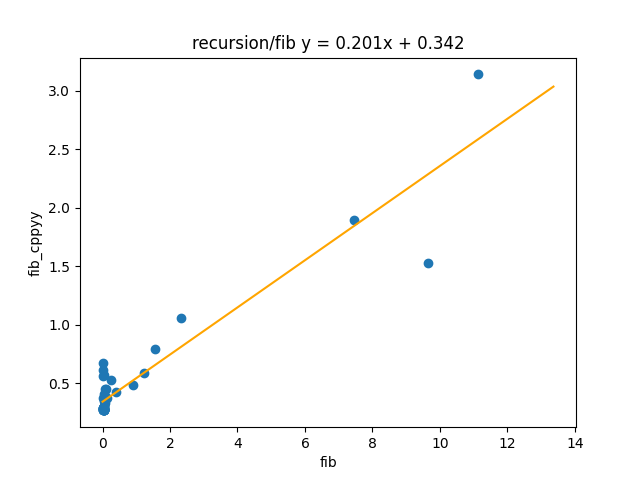
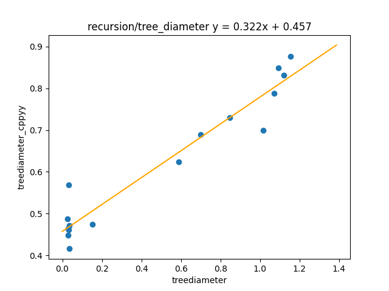
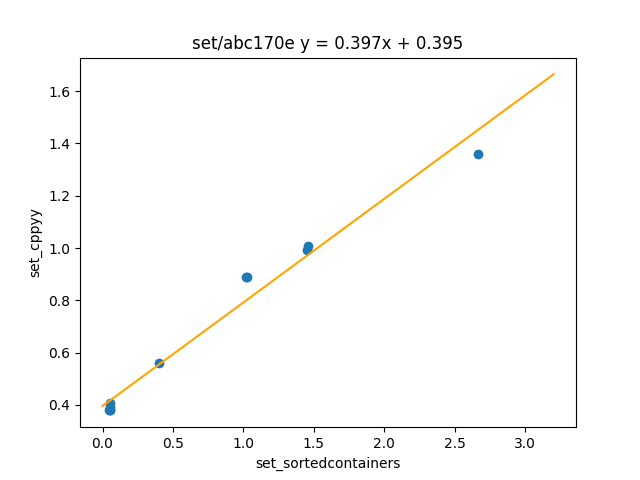
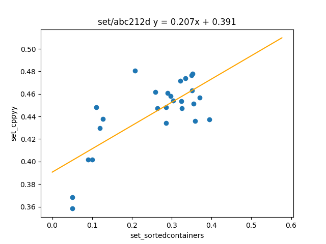
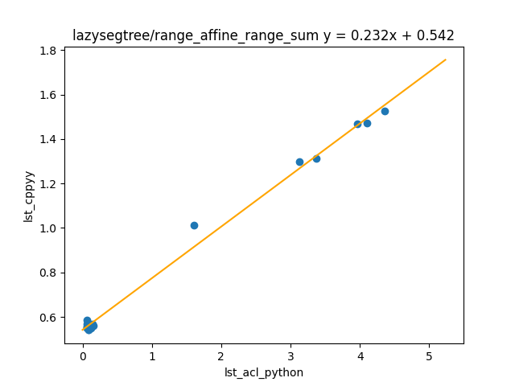
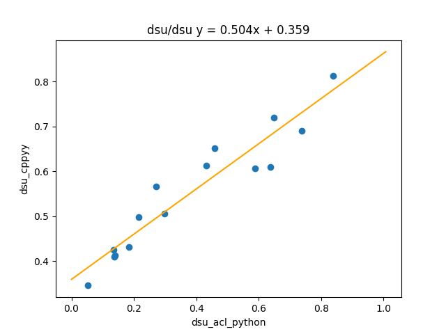
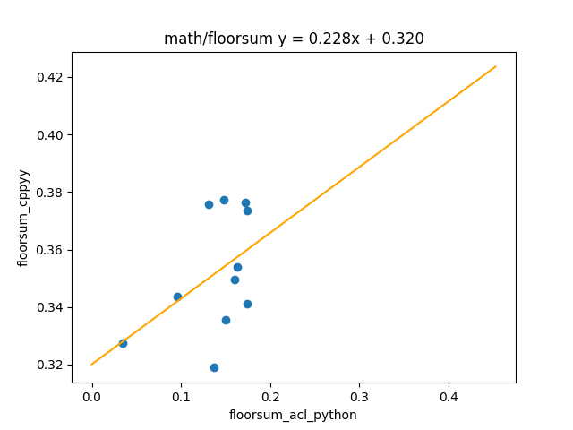
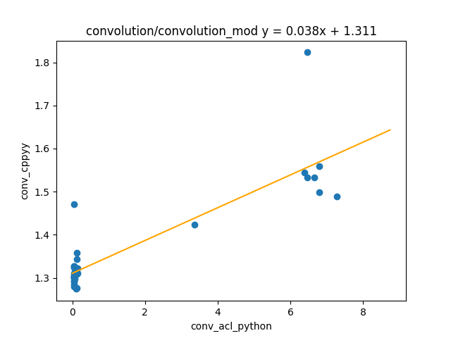

# Python高速化：cppyyを用いた競プロ高速化テク

暫定的なものです。コード整備が足りない箇所もあります。

## cppyyの概要

- Python/PyPyで活用可能なC++ bindのためのライブラリ
- C++コードをPythonコード中に書きこみ、C++の速度で動く関数やクラス、構造体を、Pythonで呼び出せる
- STLやACLも持ってこれる
- ただし、実行する度にコンパイル時間分、かなり大きめのオーバーヘッドがある
- TLが長いときや、Pythonでは特に通しづらいアルゴリズムを使うときは使えるかも？

## よい点

- 基本的にC++のパフォーマンスで実行できるので高速化が期待できる
  - 特に再帰が速い
  - 剰余算や抽象化にも強そう
- C++の資産（自作ライブラリ、AtCoder Library、その他のネット上に公開されたライブラリ）を活用可能
- Cythonizeとの比較：PyPyで利用可能
- CFFIとの比較：C++を利用可能、バイナリ提出をしなくてよい

## 悪い点

- 資料が少なく学習しにくい
- エディタの支援を受けづらい（C++部分のデバッグが大変で、補完も効きづらい）
- import自体に時間がかかる上に、毎回コンパイルしており、500 msは食うことを覚悟しておいた方がよい、これがとても痛い（4 sec問題などで力を発揮する？）
- Pythonのデータからcppyyのデータ型への変換がそんなに柔軟ではない

## 個人的に考えている使い方と所感

平衡二分探索木や抽象遅延セグメント木などの重めのデータ構造をC++で書いておき、コンテスト中にPyPyで使用できるようにするメリットはありそう（一方でC++上の実装量が増えるほどコンパイルオーバーヘッドが強くなる）。std::set, std::multiset, std::mapなどを使うインターフェースとして利用するのもよいかも。基本的に事前に準備しておくことによって効果的に活用できるものに感じた。cppyy自体はAtCoder外で使用できる可能性が低いが、cppyyで使うことを念頭に置きC++で整備したライブラリは無駄にならないので、実はコストパフォーマンスは悪くない（？）

## 最後に

性能のクセが強い。

コンパイルしたものを保持しておければ最強なのだが…

## テスト結果

まだ検証途上なので参考程度に。

手元のPCで各テストケースを処理したときに掛かった秒数を計測

### 環境

- Windows11 + WSL2
- PyPy 7.3.11
  - cppyy==2.4.1
  - cppyy-backend==1.14.9
  - cppyy-cling==6.27.0
  - sortedcontainers==2.4.0 (比較用)
  - ac-library-python==0.0.1 (比較用)
- ACL https://github.com/atcoder/ac-library
- CPU : 11th Gen Intel(R) Core(TM) i7-1165G7 @ 2.80GHz

### 再帰

#### フィボナッチ数を求める（メモ化なしで再帰）

[fib.py](./recursion/fib/src/fib.py)

[fib_cppyy.py](./recursion/fib/src/fib_cppyy.py)

テストケース：[case.py](./recursion/fib/case.py)で生成

#### 木の直径（再帰DFS）

[treediameter.py](./recursion/tree_diameter/src/treediameter.py)

[treediameter_cppyy.py](./recursion/tree_diameter/src/treediameter_cppyy.py)

テストケース：[library-checker-problems](https://github.com/yosupo06/library-checker-problems)で生成

## std::set, std::multiset等の代替物

### ABC170E

https://atcoder.jp/contests/abc170/tasks/abc170_e

[set_sortedcontainers.py](./set/abc170e/src/set_sortedcontainers.py)

[set_cppyy.py](./set/abc170e/src/set_cppyy.py)

テストケース：AtCoder公式

https://www.dropbox.com/sh/nx3tnilzqz7df8a/AAAYlTq2tiEHl5hsESw6-yfLa?dl=0

### ABC212D

https://atcoder.jp/contests/abc212/tasks/abc212_d

[set_sortedcontainers.py](./set/abc212d/src/set_sortedcontainers.py)

[set_cppyy.py](./set/abc212d/src/set_cppyy.py)

テストケース：AtCoder公式

https://www.dropbox.com/sh/nx3tnilzqz7df8a/AAAYlTq2tiEHl5hsESw6-yfLa?dl=0

## 遅延セグメント木

### range affine range sum

[lst_acl_python.py](./lazysegtree/range_affine_range_sum/src/lst_acl_python.py)

[lst_cppyy.py](./lazysegtree/range_affine_range_sum/src/lst_cppyy.py)

テストケース：[library-checker-problems](https://github.com/yosupo06/library-checker-problems)で生成

## DSU

### DSU

[dsu_acl_python.py](./dsu/dsu/src/dsu_acl_python.py)

[dsu_cppyy.py](./dsu/dsu/src/dsu_cppyy.py)

テストケース：[library-checker-problems](https://github.com/yosupo06/library-checker-problems)で生成

## math

### floorsum

[floorsum_acl_python.py](./math/floorsum/src/floorsum_acl_python.py)

[floorsum_cppyy.py](./math/floorsum/src/floorsum_cppyy.py)

テストケース：[library-checker-problems](https://github.com/yosupo06/library-checker-problems)で生成

## 畳み込み

### convolution_mod (MOD = 998244353)

[conv_acl_python.py](./convolution/convolution_mod/src/conv_acl_python.py)

[conv_cppyy.py](./convolution/convolution_mod/src/conv_cppyy.py)

テストケース：[library-checker-problems](https://github.com/yosupo06/library-checker-problems)で生成
